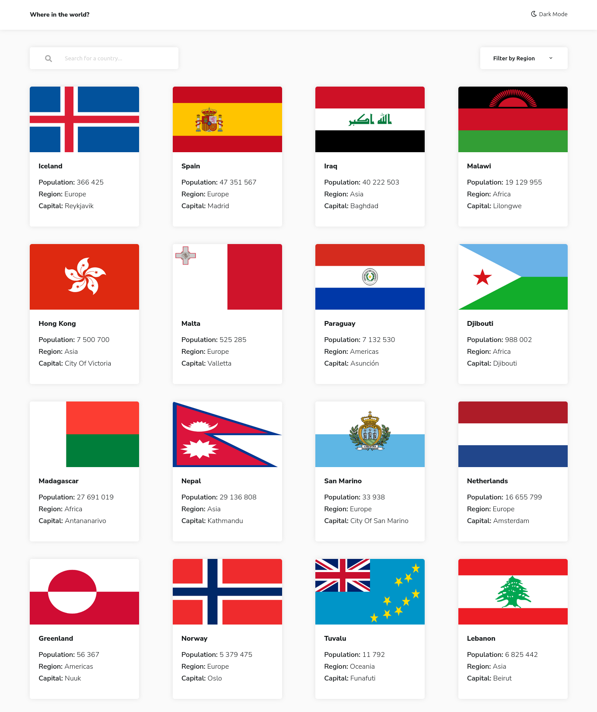

# Frontend Mentor - REST Countries API with color theme switcher solution

This is a solution to the [REST Countries API with color theme switcher challenge on Frontend Mentor](https://www.frontendmentor.io/challenges/rest-countries-api-with-color-theme-switcher-5cacc469fec04111f7b848ca). Frontend Mentor challenges help you improve your coding skills by building realistic projects.

## Table of contents

- [Overview](#overview)
  - [The challenge](#the-challenge)
  - [Screenshot](#screenshot)
  - [Links](#links)
- [My process](#my-process)
  - [Built with](#built-with)
  - [What I learned](#what-i-learned)
  - [Continued development](#continued-development)

## Overview

### The challenge

Users should be able to:

- See all countries from the API on the homepage
- Search for a country using an `input` field
- Filter countries by region
- Click on a country to see more detailed information on a separate page
- Click through to the border countries on the detail page
- Toggle the color scheme between light and dark mode

### Screenshot



### Links

- Live Site URL: [Add live site URL here](https://restcountriesapisite.netlify.app/)

## My process

### Built with

- ReactJS
- Styled Components
- Flexbox
- Mobile-first workflow
- [React](https://reactjs.org/) - JS library
- [Styled Components](https://styled-components.com/) - For styles

### What I learned

- I learnt that one should not mutate state directly, but only mutate a copy of the original state.

```js
const [countries, setCountries] = useState([]);

useEffect(() => {
  fetch(url)
    .then((response) => response.json())
    .then((data) => {
      setCountries(data);
      console.log(data);
    })
    .catch((err) => {
      console.log(err.message);
    });
},[]);

const someRandomFunction = () => {
  if(something magical happens) {
    setCountries(something magical)
  }
}

```

Yeah, don't do that.

- Used anything other that pure css for styling, first time trying styled components.

### Continued development

- Use styled components in more projects to come.
- Get better at utilising some react concepts like the context api.
- Try out an alternative to the React context api, maybe Redux.
# restcountriesapi
